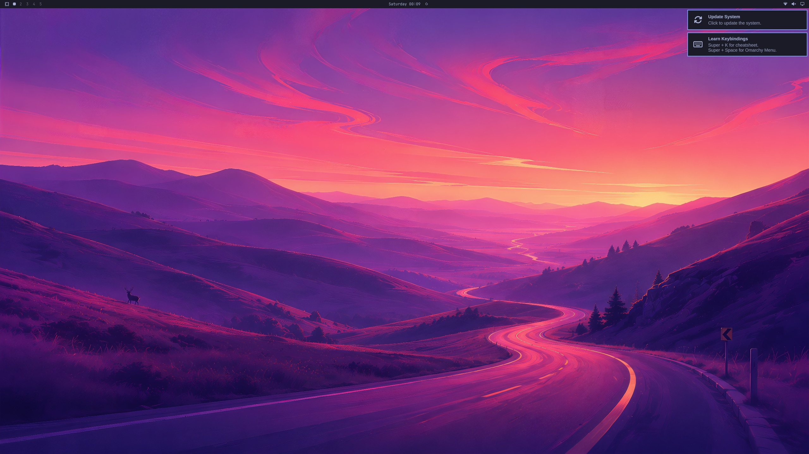

# Slice 2.1 evidence: upstream Omarchy 4.0.4 on the Jetson AGX Thor (USB drive)

Attended, 2026-09-25/26. The owner was at the Thor; checks ran over SSH from the laptop (LAN).
Every row is **real data** from the Thor unless marked otherwise.

## Install

`install-thor-omarchy.sh --write` from JetPack (commit 56b9b43), 907 packages, exit 0:
`installed: Omarchy 4.0.4-1 with the Thor layer on /dev/sda2`. Log on the Thor's NVMe:
`~/raytone/evidence/slice2-install.log`. Backup of the drive's root before the install:
`~/raytone/backups/usb-root-before-omarchy.tar.gz`.

## First boot (2026-09-25 22:56): three faults

| Symptom | Root cause | Fix |
|---|---|---|
| SDDM rejects the correct password (tty2 login with it works) | Omarchy's greeter is password-only and logs in `userModel.lastUser`; SDDM's journal shows `Authentication for user "" failed`. The Omarchy ISO seeds `/var/lib/sddm/state.conf` (omarchy-iso `configure_login`); a non-ISO install has none | a639251: the installer seeds the last user and session and `RememberLastUser`, as the ISO does for unencrypted installs (no autologin) |
| Wi-Fi not connected | Omarchy's aarch64 dependency `iwd` ships `80-iwd.link` (`NamePolicy=keep kernel`): the card is `wlan0`, the profile copied from JetPack was bound to `wlP1p1s0` | a639251: `interface-name` is dropped from Wi-Fi profiles |
| No ping or SSH although `ufw status` lists 22/tcp | NVIDIA's kernel has `# CONFIG_NFT_LIMIT is not set`. iptables-nft turns ufw's `-m limit` into the nf_tables limit expression, `iptables-restore` fails (`RULE_APPEND failed (No such file or directory)`), `ufw.service` fails and only the default DROP policy is left. Reproduced by hand: `iptables -A t -m limit ...` fails, `-j LOG`, `-m conntrack`, `-m comment` work | 4866d23: `raytone-thor-nft-modules` builds `nft_limit` from NVIDIA's R39.2.1 kernel source against the pinned headers deb; vermagic `6.8.12-1021-tegra SMP preempt mod_unload modversions aarch64`, the same as NVIDIA's modules |

The mouse was fine (it had gone to sleep). The screensaver exits on a key press, not a click: that is
upstream's `omarchy-screensaver` (it exits on keyboard input or loss of focus), left as is.

## Reboot acceptance (2026-09-26 00:05, `raytone-arch` chosen at the GRUB menu)

| Check | Result |
|---|---|
| SSH through the firewall | 2 min after the reboot command |
| Wi-Fi | `wlan0:wifi:connected:<home Wi-Fi>`, 192.168.1.35/24, no manual step |
| UFW | `ufw.service` active, 0 failures in its journal; `nft_limit` autoloaded from `/lib/modules/6.8.12-1021-tegra/updates/net/netfilter/nft_limit.ko` (15 users); `ufw-user-input` has `--dport 22 -j ACCEPT` and `--dport 5353 -j ACCEPT` |
| SDDM | greeter on tty1 remembers `nvidia`; the owner logged in with the password |
| Session | `Type=wayland`, `Class=user`, `State=active`; Quickshell (`quickshell -n -p /usr/share/omarchy/shell`) running |
| Display | `HDMI-A-1 2560x1440@74.97100`, scale 1 |
| Renderer | Hyprland 0.56.2 (the port's build 0.56.2-3.1), `Vendor: NVIDIA Corporation`, `Renderer: NVIDIA Thor/PCIe`, display device `/dev/dri/card3` |
| Packages | omarchy 4.0.4-1, omarchy-settings 4.0.4-1, raytone-thor-omarchy 0.1.0-1, raytone-thor-nft-modules 6.8.12.l4t39.2.1-1 |
| Failed units | `bluetooth.service` only (vendor Bluetooth firmware and driver: Slice 2.2) |

## State

- The fixes for the three faults were applied to the running drive by hand first (SDDM state,
  `nmcli connection modify ... connection.interface-name ""`, `pacman -U raytone-thor-nft-modules`),
  then the reboot checked them. A fresh `install-thor-omarchy.sh` run has them in code (tests pass) but
  has **not** been rerun on the drive: code, not deployed-path, for a clean install.
- raytone-thor-omarchy 0.1.0-2 (which only adds the nft dependency) is committed, not yet built.
- Do not click the "Update System" notification until Slice 2.2 gates `omarchy-update` and
  `omarchy-refresh-pacman` (Codex review, round 2).
